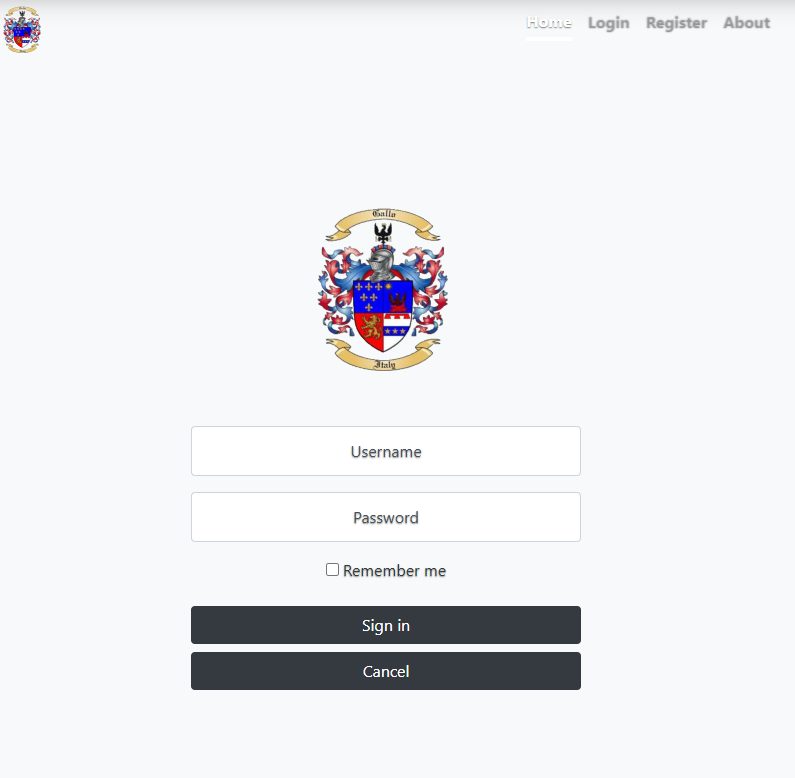

# Salumi-Di-Gallo-Capstone
 A recipe website for cured meats. The purpose is for readers to come to the site, search through available recipes and get the information they need to make it themselves. Users must make an account to view the available recipes. Adding, editing, or removing recipes will be reserved for users with admin access.

 ****

On the backend this website will:
 - be a single page, dynamically created
 - encrypt user passwords for security (*password hashing*)
 - store logged in validation in either session or local storage depending on remember me checkbox
 - be a custom rest api node server which will feature:
    - modules
    - methods
    - an exception log
    - JSON envelopes for more detailed data transmission 

 ****
## Required info
 `npm install express express-fileupload nodemon cors body-parser password-hash -g --save`

 - Runs on http://localhost:8081 

 `npm start` to start server
 
 `Ctrl+C` to kill server

 **For testing recipe add,edit, and deletes use:**

 
| Username      | Password      | 
| ------------- |:-------------:| 
| admin         | password      | 
   

 Otherwise create your own account and log in with that for view only

### Landing page
***
User is greated by the website name, logo, description, and login and register buttons

on the backend: all functions are contained in an object which is exported to the index.js

### User log in
***
The user login page will take in a username and password. 

On the backend, it will check to see if the username exists, if it does it will check if a hash of the login password matches the stored hashed password. If it matches, a validation is passed to the server letting the user into the site.

### User creation
***
The user registration page will take in a username and password, the public JS file will have a confirm password validation. 

On the backend logic is placed to prevent duplicate usernames, if that check is passed the entered password is hashed.

### Recipes page
***
After a succesful login the user will be greated with the content page. It allows the user to search through available recipes and choose one to view.
If the user logging in has a user type of "admin" a new nav link is available for "Add new recipe"

There are three radio buttons to filter search criteria. The default, view all has just one Ddl populated with all recipe name. Picking any of the other two fills the Ddl with the search criteria and generates a second Ddl with the recipes matching that criteria. Choosing a recipe generates the recipe below

### Add new recipe page
***
If the user logged in with admin credentials, there is a nav bar link called "Add recipe"
clicking this brings the user to a form which prompts them to add in the details for the recipe. The user can add or remove extra inputs as needed. In addition an upload file field is available allowing a recipe image to be uploaded

### Edit recipe
*** 
If the user(admin) clicks the edit button in the corner of a recipe, the fields become input fields to allow changes to be made.
A delete button is also available, clicking will prompt a confirmation window that will delete the recipe if confirmed.

